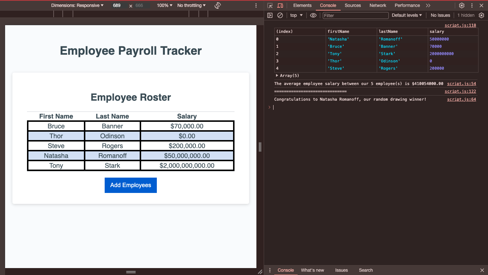

# Employee Payroll Tracker - JavaScript

## Description

This project is the challenge assignment for Module 03 of the RICE Fullstack Coding Bootcamp. The purpose is to obtain and manipulate employee data.

I am to be credited for the below mentioned functions:

- collectEmployees
- displayAverageSalary
- getRandomEmployee
- capitalCaseWord

### The Objectives

- Understand the following functions and methods:
  - `isNAN`
  - `parseFloat`
  - `Window.prompt`
  - `Math.floor`
  - `Math.random`
- Introduction to working with objects
  - Extract values from objects within an array and log them to the console
- Store user input from `Window.prompt`
- Utilize `while` and `for` loops to iterate through an array

## Usage

Click the "Add Employee" button. The window will prompt the user to enter first name, last name, and salary of employee. The user will be prompted to re-enter the salary until a valid number is entered.

The user will be prompted to enter another employee until done. Once cancel is selected, a table of the employee data will be displayed on the screen, and messages will be logged to the console.

## Credits

The starter code was provided by the Bootcamp. I am to be credited solely for the functions outlined in the Description.
